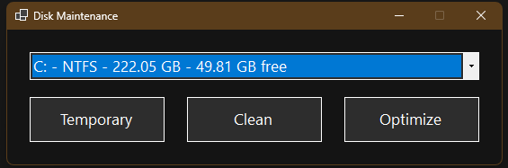

# Disk Maintenance 🛠️



**Disk Maintenance** is a lightweight **Windows utility** built with **C#** and **.NET WinForms**. It helps keep your system clean and responsive by removing temporary files, performing disk cleanup, and providing basic disk optimization—all through a simple, intuitive interface.

---

## 🚀 Features

* Cleans temporary files in:

  * `C:\Windows\Temp`
  * `C:\Users\<User>\AppData\Local\Temp`
* Disk cleanup
* Disk optimization
* Lightweight, user-friendly WinForms interface
* Safe and fast operations

---

## 🛠️ Running / Development Requirements

To build, run, or contribute to the project, you need:

* **OS:** Windows 10 or 11
* **IDE:** Visual Studio 2022 or later **or** VS Code with C# extension
* **SDK:** .NET 9 SDK ([Download here](https://dotnet.microsoft.com/en-us/download/dotnet/9.0))
* **Workload:** Desktop Development with C++ in Visual Studio (required for building WinForms projects)
* Minimum **2 GB free disk space

---

## 🏗️ Cloning, Building, and Creating an Executable

### 1️⃣ Clone the Repository

Open a terminal in the folder where you want the project and run:

```bash
git clone <repo-url>
cd DiskMaintenance
```

### 2️⃣ Build the Project

To build a self-contained `.exe` for Windows using .NET, run:

```bash
dotnet publish -c Release -r win-x64 --self-contained true -p:PublishSingleFile=true
```

* `-c Release` → builds in Release mode
* `-r win-x64` → targets 64-bit Windows
* `--self-contained true` → includes the .NET runtime so users don’t need it installed
* `-p:PublishSingleFile=true` → outputs a single `.exe` file

### 3️⃣ Locate the Executable

After building, the `.exe` can be found in:

```
DiskMaintenance\bin\Release\net9.0\win-x64\publish\
```

You can now run the executable directly without requiring a separate .NET installation.

---

## ⚡ Quick Start

For a full quick start:

```bash
git clone <repo-url>
cd DiskMaintenance
dotnet publish -c Release -r win-x64 --self-contained true -p:PublishSingleFile=true
cd bin\Release\net9.0\win-x64\publish
.\DiskMaintenance.exe
```

This will clone the repo, build a self-contained `.exe`, and run the application immediately.

---

## ✅ Notes

* Make sure your system has **enough disk space** for building and publishing the project.
* You can run the `.exe` on any compatible Windows machine, even if .NET is not installed.
